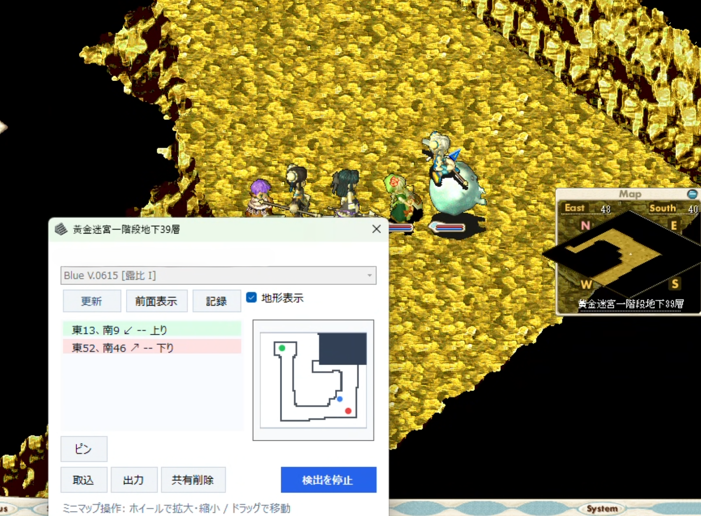

# CgStairFinder
Blue Crossgate 向けのマップ補助ツールです。  
階段座標の検出・履歴管理・共有データ取込/出力・ミニマップ表示・ピンメモを提供します。



## 主な機能
- 階段座標（上り/下り/移動可）の自動検出
- ミニマップ表示（ズーム・ドラッグ・現在地復帰）
- 階段履歴のローカル保存
- 共有データ（`.cgshare`）の出力/取込
- マップごとのピン（タイトル・詳細）保存と共有

## 動作環境
- Windows
- .NET Framework 4.6
- Visual Studio / MSBuild

## ビルド
```powershell
msbuild src\CgStairFinder.sln /p:Configuration=Debug
msbuild src\CgStairFinder.sln /p:Configuration=Release
```

## 実行
`src\CgStairFinder\bin\Release\CgStairFinder.exe` を起動し、ゲームフォルダを設定して「検出を開始」を押してください。
